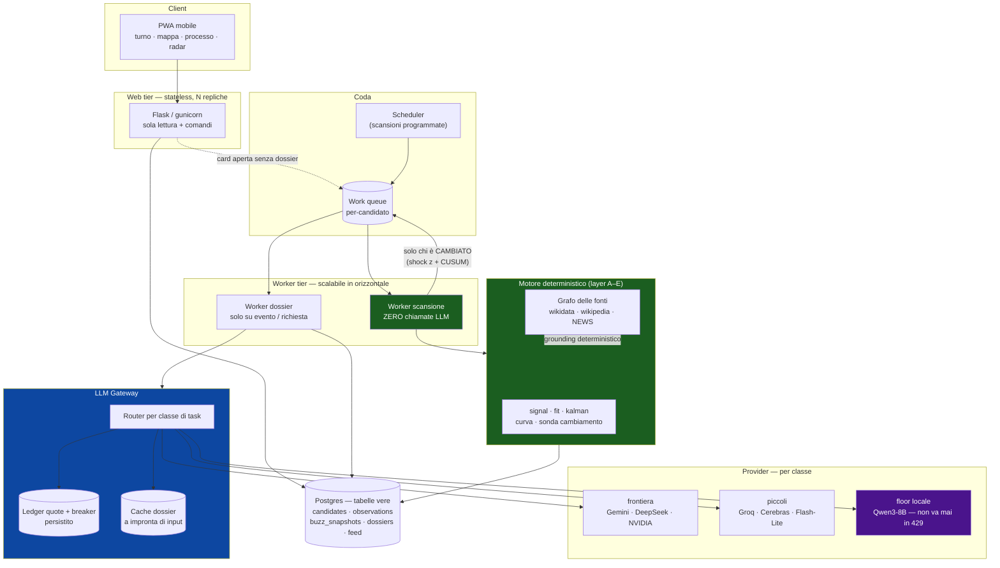

# Architettura di produzione — SENTINEL / OB1 Radar

> Documento di progettazione. Non descrive il codice attuale: descrive dove
> deve arrivare e in che ordine. L'architettura di oggi è di sviluppo/test ed
> è dichiaratamente tale (un processo, `--workers 1`, stato in RAM, scansione
> dentro una richiesta HTTP).
>
> Dati provider verificati il 2026-08-02 (fonti in fondo). Le quote free
> cambiano spesso — stessa disciplina già scritta nei commenti di
> `nvidia_client.py` e `gemini_client.py`: **verificare dal vivo prima di
> fidarsi di un numero letto da qualche parte, questo documento compreso.**

---

## 0. Il problema, riformulato

La domanda di partenza è "come azzero i costi dell'API Gemini". La risposta
utile non è "cambiare provider", ed è meglio dirlo subito perché cambia tutto
il piano.

Sui free tier **non paghi in euro, paghi in richieste al giorno**. La quota è
fissa, non si accumula, e non si compra. Da questo discendono due conseguenze:

- **Sommare provider è una leva lineare e fragile.** Ogni provider aggiunto
  aggiunge un numero finito di richieste/giorno e una nuova dipendenza dalla
  generosità di qualcun altro. Sposta il muro, non lo toglie.
- **Ridurre la domanda è una leva moltiplicativa.** Ed è l'unica che regge la
  crescita della pool candidati.

C'è poi un fatto scomodo da mettere in chiaro: **la spesa Gemini attuale è
quasi certamente piccola in valore assoluto.** Gemini 2.5 Flash a tariffa
piena costa $0.30/M token in ingresso e $2.50/M in uscita; con prompt della
dimensione dei vostri (`context` è una manciata di righe) 32 chiamate per
scansione valgono frazioni di centesimo. Se in fattura vedete una cifra che
si nota, non arriva dai token: arriva o dalla **frequenza** delle scansioni,
o — più probabile — dal **grounding web**, che è un servizio a parte fatturato
per richiesta (vedi §3). Vale la pena guardare la voce esatta prima di
ottimizzare la cosa sbagliata.

Il vero problema di produzione non è quindi il costo di oggi. È che
**l'architettura attuale consuma quota in proporzione alla dimensione della
pool**, e la pool è destinata a crescere. È quello che va invertito.

### Il budget free reale, oggi

| Provider | RPM | RPD | Note per il vostro caso |
|---|---|---|---|
| Google AI Studio — Gemini 2.5 Flash | 15 | ~250 | quote tagliate a dic-2025; è il vostro provider primario |
| Google AI Studio — Flash-Lite | — | ~1.000 | classe inferiore, ottimo per task di formato |
| **OpenRouter `:free`** | 20 | **50** (1.000 se avete mai comprato $10 di credito) | ⚠️ **il vostro collo di bottiglia**, vedi §3 |
| Groq | 30 | 1.000 (14.400 su `llama-3.1-8b-instant`) | il tetto più alto in assoluto, su modello piccolo |
| Cerebras | 30 | ~1M token/giorno | pensato per batch, non per interattivo |
| NVIDIA NIM | 40 | non pubblicato | già integrato da voi |
| Mistral La Plateforme | 2 | 1B token/mese | lentissimo, capiente |
| Cloudflare Workers AI | — | 10.000 neuroni/giorno | |

Ordini di grandezza che ne derivano, e che useremo per dimensionare:

- budget aggregato su **modelli di classe frontiera**: ~2.000–3.000 richieste/giorno
- budget aggregato su **modelli piccoli** (formato, JSON, riassunto): ~15.000–20.000 richieste/giorno

Sono numeri grandi. Il punto di tutto il documento è che l'architettura
attuale riesce comunque a sfondarli.

---

## 1. Dove va la quota oggi

Conto esatto, letto dal codice:

- `run_swarm_dossier()` = **4 chiamate sequenziali** per candidato
  (Cronista → Verificatore → Scettico → Giudice), tutte sullo **stesso**
  `(call_fn, model)` risolto una volta dal Cronista.
- `swarm.top_n_candidates_for_swarm: 8` → **32 chiamate per scansione**,
  più fino a 8 tentativi "grounded" su OpenRouter.
- Ogni fallimento nella catena di fallback **consuma comunque una richiesta**
  contata dal provider. Il costo reale per scansione è ≥ 40 richieste.
- `_reset_model_failures()` all'inizio di ogni `refresh_radar()`: il circuit
  breaker vale per una sola scansione. Ogni run **ri-brucia quota** per
  riscoprire daccapo quali modelli sono morti. È il difetto più caro del
  sistema attuale e si ripara senza toccare l'architettura (§2, leva D).

Proiettiamo sulla scala che avete **già dichiarata in `radar_config.yaml`**:
Serie C/D + CONMEBOL U20/U17 + 16 pool per nazionalità ≈ **5.100 candidati**.
Oggi l'AI ne tocca 8. Portare i dossier a 500 candidati/giorno con questa
architettura significa 2.000 chiamate + 500 grounded al giorno: **fuori quota
su ogni singolo provider free**, e scomodo perfino sommandoli tutti — perché
le 2.000 sono tutte di classe frontiera, che è la fascia scarsa.

---

## 2. Le leve, in ordine di resa

### Leva A — l'AI esce dal percorso critico *(la leva grossa)*

L'osservazione decisiva sul vostro codice: **i layer A–E non usano l'AI.**
Signal Score, Fit Score, filtro di Kalman, sonda di cambiamento di stato,
curva di adozione, contraddittorio — tutto Python deterministico e
ispezionabile, per scelta dichiarata. L'AI produce **solo prosa** (le quattro
voci) più un campo strutturato (`club_aggiornato`).

Quindi **la scansione non ha bisogno dell'AI per funzionare.** Da qui:

> **La scansione costa zero chiamate LLM.** Punteggi, curva, turno, mappa,
> archivio: generati per l'**intera** pool, senza AI, a costo nullo.
> **Il dossier si genera su evento o su richiesta**, mai in batch su top-N.

Due trigger, entrambi **già implementati da voi**, ma usati nel posto sbagliato:

1. **`state_change` (shock z + CUSUM).** Oggi è calcolato in *fase 2* di
   `refresh_radar()`, cioè **dopo** aver già speso il dossier. Spostatelo
   **prima** e rendetelo il gate d'ingresso. Il dossier si genera solo per chi
   è davvero cambiato. Il costo AI diventa **O(eventi)**, non O(pool).
2. **Generazione pigra all'apertura.** Il dossier di un candidato che nessuno
   apre non serve a nessuno. Card aperta → dossier generato al momento, con
   stato onesto nel frattempo ("dossier non ancora generato"). Il costo si
   lega all'attenzione umana reale, che è intrinsecamente limitata: uno scout
   legge decine di schede al giorno, non migliaia.

È questo che rende il sistema **indipendente dalla dimensione della pool**:
5.000 o 50.000 candidati costano uguale in AI.

### Leva B — 4 chiamate → 1

Le quattro voci sono una catena sequenziale **sullo stesso modello**: `call_fn`
e `model` vengono risolti dal Cronista e riusati per gli altri tre ruoli. Non
è uno swarm di modelli in disaccordo — è **un solo modello che si contraddice
in quattro turni**. Il valore epistemico è modesto; il costo è esattamente 4×.

- **Default proposto: una sola chiamata** con output JSON a quattro sezioni +
  verdetto. −75% di chiamate, output in UI identico.
- **Se volete il contraddittorio vero**, fatelo con **modelli diversi da
  provider diversi** (Cronista, Scettico e Giudice su tre quote separate): tre
  chiamate su tre budget distinti sono meglio di quattro sullo stesso. Ma è
  una scelta di *qualità*, non di costo — e va spesa dove conta, quindi come
  modalità "approfondisci" attivabile a mano sul singolo candidato, non come
  default per tutti.

### Leva C — cache a impronta di input

`swarm.rerun_threshold_points: 8` è già una cache, ma implicita e fragile.
Generalizzatela a una chiave esplicita:

```
hash(candidate_id, club_risolto, bucket(signal_score), fingerprint(snapshot_buzz), prompt_version)
```

`prompt_version` è la parte che oggi manca ed è la più importante: senza,
cambiare un prompt non invalida niente e continuate a servire dossier scritti
con istruzioni vecchie. A regime la maggior parte dei candidati non cambia
settimana su settimana — il tasso di riuso atteso è alto.

### Leva D — il gateway provider *(unit cost)*

Da fare **dopo** A/B/C, non prima. Un componente nuovo, `llm_gateway.py`, che
sostituisce `_candidate_models()` e `_call_with_fallback()`. Cinque punti,
ciascuno su un buco reale del codice attuale:

1. **Registro dichiarativo** (`providers.yaml`): endpoint, variabile della
   chiave, limiti (rpm/rpd/tpm), tag di capacità (`web_search`, `json_mode`,
   contesto), classe di qualità. Tutti i provider sono OpenAI-compatibili →
   una sola funzione di chiamata, differenza solo in `base_url` e header. Che
   la cosa regga l'avete già dimostrato: i vostri tre client sono lo stesso
   file tre volte.
2. **Ledger di budget persistito** (Postgres, non memoria di processo):
   contatore per `(provider, modello, finestra)`, token bucket per l'RPM e
   contatore giornaliero per l'RPD con reset all'orario del provider. È ciò
   che oggi manca del tutto — `_model_failures` vive in RAM, non è condiviso
   tra processi e si azzera a ogni scansione.
3. **Breaker persistito con TTL semantico.** Oggi i tre casi sono trattati
   come uno solo, e riscoperti ogni run:
   - `429` con `limit: 0` (i vostri `gemini-2.0-flash*`) = **non abilitato** →
     blocco lungo, giorni;
   - `429` di rate → blocco **fino al reset della finestra**;
   - `404` "not found for account" → **rimozione dal registro**, non è un
     fallimento, è un modello che non esiste per voi.
4. **Routing per classe di task**, non per ordine fisso:
   - `grounded_facts` → richiede `web_search` (oggi solo OpenRouter — ma vedi §3, dove questa classe viene eliminata)
   - `reasoning` → classe frontiera (Gemini 2.5 Flash, DeepSeek R1)
   - `formatting` / `json` → qualunque modello piccolo (Groq 8b, Cerebras,
     Flash-Lite), dove avete 14.400 richieste/giorno che per il vostro volume
     sono di fatto illimitate.

   Oggi il **Giudice** — che deve solo emettere un JSON con cinque campi —
   gira sullo stesso modello frontiera del Cronista. È la quota più preziosa
   spesa sul task meno esigente. Solo questo spostamento libera un quarto del
   budget di fascia alta.
5. **Degradazione dichiarata.** A quota esaurita il gateway non improvvisa:
   errore esplicito (come già fate, ed è la scelta giusta) e in UI "dossier
   non generabile oggi: quota AI esaurita". Coerente con la vostra regola di
   non spacciare per verificato ciò che non lo è.

**Prior art, per non riscrivere ciò che esiste.**
[LiteLLM](https://github.com/BerriAI/litellm) (~55k stelle, attivissimo) fa
già gateway, fallback, budget, retry e logging su 100+ provider in formato
OpenAI, ed è self-hostabile come proxy. Valutatelo come **sostituto** di
`llm_gateway.py`: mettete il proxy davanti a tutto e i vostri tre client
collassano in una sola `base_url`. Quello che LiteLLM **non** vi dà, ed è la
parte specificamente vostra, è il **routing per classe di task** e il **gate
sullo state change** — quello resta codice del dominio, ed è giusto che lo sia.

Per popolare `providers.yaml`,
[cheahjs/free-llm-api-resources](https://github.com/cheahjs/free-llm-api-resources)
(~29k stelle, generato da script e mantenuto) è la fonte migliore per il seed.
**Da usare come seed, non come verità**: la vostra regola di verificare ogni
modello con una chiamata reale prima di metterlo in `VERIFIED_MODELS` va
mantenuta esattamente com'è.

### Leva E — il pavimento self-hosted

Per non dipendere dalla generosità altrui: un modello piccolo locale (classe
Qwen3-8B / Llama-3.1-8B via llama.cpp o Ollama) su una VM, come **ultimo
anello** della catena. Non è di frontiera e non deve esserlo: serve alla
classe `formatting`, che dopo la Leva D è la maggioranza del traffico.

Il vantaggio non è il prezzo, è che **non va mai in 429**: il sistema acquista
un comportamento definito anche a quote esaurite. Costo ~€15–30/mese di VM —
denaro vero, ma *prevedibile*, ed è la sola cosa che compra indipendenza.
Da fare per ultimo, e solo se le tappe 1–3 non bastano già.

---

## 3. Il caso speciale: il grounding web

Va trattato a parte perché è il punto più fragile dell'intero sistema, e
probabilmente la risposta alla domanda iniziale sui costi.

Due fatti verificati:

- **`openrouter:web_search` è fatturato a parte, anche sui modelli `:free`.**
  La documentazione OpenRouter lo dice esplicitamente: ~$0.005 per richiesta
  con Exa o Perplexity, ~$0.001 con Parallel. Il *modello* è gratis, la
  *ricerca* no. Con 8 dossier per scansione sono ~$0.04 a scansione — poco in
  assoluto, ma cresce esattamente con la leva che volete tirare (più dossier).
- **OpenRouter free è a 50 richieste/giorno** sotto i $10 di credito storico.
  Il Cronista grounded — l'unica voce che verifica il club sul web — passa
  **solo** da lì (`_grounded_cronista_pool()`). A 8 chiamate grounded per
  scansione, **sei scansioni al giorno e siete a secco**, e il sistema
  retrocede silenziosamente a `grounded=False`. A scala non è un problema di
  costo: è **la funzione che si spegne per prima**, ed è quella che tiene
  aggiornato il club.

### La proposta: disaccoppiare la ricerca dal modello

La ricerca del club **non ha bisogno di un LLM con tool**. Ha bisogno di una
query e di un parser. E l'infrastruttura ce l'avete già: `buzz_score()`
interroga Google News RSS per ogni candidato della buzz pool, a ogni run.

Il club aggiornato si estrae **da quelle stesse risposte** con euristica
esplicita, e diventa **un'osservazione nel grafo delle fonti a livello
`news` (2)** — che è esattamente il posto che `radar_config.yaml` ha già
previsto per lei:

```yaml
piramide:
  livelli:
    news: 2   # stampa via ricerca web (la piu' fresca che abbiamo)
  regole_campo:
    club: dal_basso   # fatto veloce
```

Il livello `news` è già definito nella piramide e la regola `dal_basso` per il
club è già scritta: **oggi però nessun lettore emette osservazioni a quel
livello** (`_READER_FONTE` copre solo `wikidata` e `wikipedia`). Il posto è
apparecchiato e vuoto. Riempirlo produce, in un colpo solo:

- grounding **deterministico, gratuito e ispezionabile** — e ispezionabile è
  la parola che conta, visto il resto del progetto;
- il Cronista non deve più cercare: **legge il grafo già risolto**;
- `_grounded_cronista_pool()` sparisce, e con lei la dipendenza da OpenRouter
  e la sua voce di fattura;
- `club_verificato_via_ricerca` diventa una proprietà **del dato**, non della
  fiducia in ciò che un modello *dice* di aver fatto — cosa che il vostro
  commento su `web_search_tool_available` già ammette di non poter garantire.

È la modifica singola col miglior rapporto valore/rischio del documento:
toglie un costo, toglie un collo di bottiglia, e rende più onesto un campo
che oggi è dichiaratamente incerto.

---

## 4. I due blocchi strutturali (non-AI)

Vanno detti: "produzione su larga scala" non regge senza, e nessuna
ottimizzazione AI li aggira.

### Blocco 1 — lo stato del job vive in RAM

`--workers 1` è deliberato e ben documentato nel `Dockerfile`, ma è
precisamente ciò che impedisce di scalare in orizzontale: un processo, una
scansione alla volta, e un riavvio di Cloud Run perde il job in corso. La
scansione è per giunta un thread dentro il ciclo di vita di una richiesta
HTTP, con tutti i vincoli di timeout che vi siete già dovuti gestire
(`--timeout 570`, `--no-cpu-throttling`).

**Fix:** stato del job in Postgres; web **stateless** a N repliche; **worker
separato** che consuma una coda di work item per-candidato. La scansione
smette di dover stare sotto i 570 secondi, e "Aggiorna" smette di essere il
trigger — diventa uno scheduler (Cloud Scheduler → coda).

### Blocco 2 — persistenza a blob JSON

`_load_json` / `_save_json` leggono e riscrivono **documenti interi**
(`radar_feed`, `buzz_history`, `observations`) su una singola riga Postgres
con chiave `path.stem`. Con 5.000 candidati × 20 run di storico, `buzz_history`
è già nell'ordine dei MB **riscritti a ogni salvataggio** — e due scritture
concorrenti si sovrascrivono a vicenda in silenzio (last-write-wins).

Il commento sul ledger di validazione ha già visto il problema:

> *"con Postgres ogni load/save e' un round-trip di rete, farne due per
> candidato non scala"*

La diagnosi è giusta, ma la cura non è caricare una volta sola: è **smettere
di usare Postgres come un filesystem**. Tabelle vere — `candidates`,
`observations`, `buzz_snapshots`, `dossiers`, `feed_entries` — con indici e
scritture per riga.

**Ordine:** Blocco 2 **prima** del Blocco 1. La coda ha bisogno di uno stato
scrivibile in modo concorrente per esistere.

---

## 5. Architettura target



Le due proprietà da leggere nel diagramma:

- il ramo **verde** (scansione + motore deterministico) gira sull'intera pool
  e **non tocca mai** il gateway: costo AI zero, a qualunque scala;
- il ramo **blu** (dossier) è alimentato solo da due sorgenti strette — un
  cambiamento di stato rilevato, o una card che un umano ha aperto.

---

## 6. Piano in cinque tappe

Ogni tappa consegna valore da sola e non richiede la successiva.

| # | Tappa | Effetto | Rischio | Stato |
|---|---|---|---|---|
| 1 | **Grounding deterministico** (§3): lettore `news` → grafo delle fonti | elimina la dipendenza da OpenRouter e la voce di spesa reale; niente cambio di schema | basso | ✅ fatto |
| 2 | **Gate su `state_change`** (leva A) | l'AI esce dal percorso critico: da qui la pool può crescere a costo costante | basso | ✅ fatto |
| 2b | **Dossier pigro all'apertura** (leva A) | lega il costo residuo all'attenzione umana reale | basso | da fare |
| 3 | **1 chiamata invece di 4 + cache a impronta** (leve B, C) | −75% sulle chiamate, poi −alto% sul residuo per riuso | medio (cambia il testo dei dossier) | da fare |
| 4 | **Persistenza a tabelle** (blocco 2) | rimuove il last-write-wins e la riscrittura di blob da MB | medio (migrazione dati) | da fare |
| 5 | **Worker separato + gateway/LiteLLM + floor locale** (blocco 1, leve D, E) | scala orizzontale reale e comportamento definito a quote esaurite | alto | da fare |

### Cosa è già in produzione dopo le tappe 1 e 2

- `news_reader.py` legge il club dai titoli che il buzz check scarica comunque,
  a **vocabolario chiuso** (mai un club inventato) e con indizio esplicito di
  trasferimento richiesto. Le osservazioni entrano nel grafo a livello `news`
  con data e URL, e il risolutore le fa vincere sui claim Wikidata non datati.
- `swarm.web_search_grounding: false` — il server tool a pagamento è spento.
  Il codice resta dietro il flag per poterci tornare.
- `swarm.require_state_change: true` — il dossier si spende su chi è cambiato.
  `max_dossiers_per_run` è il tetto di sicurezza, e **non è ridondante**: al
  primo run di un candidato la sonda risponde "nuovo ingresso" per tutti.
- Kalman e CUSUM girano ora sull'**intera classifica**, non più solo sui
  candidati già ammessi al dossier. Effetto collaterale voluto: la deriva lenta
  (CUSUM) può finalmente accumularsi per chi non è mai stato nel top-N — prima
  veniva aggiornata solo dentro `_finalize_dossier`, quindi per quei candidati
  non scattava mai.
- `CLUB DA CORREGGERE` ora nasce dal **grafo** e vale per l'intera pool a costo
  zero, non più solo per gli 8 candidati che arrivavano al dossier e solo se il
  modello aveva davvero cercato.

Verificato con uno smoke test a rete simulata su tre run consecutivi: il
trasferimento viene letto e risolto al run 1 **senza nessuna chiamata AI**;
al run 3, senza cambiamenti, i dossier generati sono **zero**.

**Dimensionamento atteso dopo la tappa 3.** Con pool 5.000 e un tasso di
cambiamento di stato del 5% al giorno: ~250 dossier/giorno × 1 chiamata =
**~250 richieste/giorno**. Contro un budget aggregato di classe frontiera di
2.000–3.000/giorno, sta comodamente **dentro il free tier di un solo
provider** — e gli altri tornano a essere ridondanza vera invece che una
stampella per arrivare a fine giornata. Anche con la pool a 50.000 (10×) si
resta dentro l'aggregato.

Questo è il senso della riformulazione iniziale: la leva sulla domanda vale
più di qualunque somma di provider.

---

## 7. Cosa non fare

- **Non moltiplicare gli account per moltiplicare le quote.** La rotazione
  multi-chiave sullo stesso provider viola i termini di servizio di Google,
  Groq e OpenRouter. Tecnicamente funziona, e proprio per questo va detto:
  funzionare non lo rende un'architettura. Mette il prodotto su una base che
  può sparire in un giorno, senza preavviso e senza appello — e un radar che
  si spegne quando serve non vale la quota che ha risparmiato.
- **Non aggiungere provider prima delle tappe 1–3.** Sommare quote a una
  domanda che cresce con la pool sposta il muro di qualche settimana.
- **Non far scegliere il modello all'utente.** La classe di task la decide il
  sistema; il modello è un dettaglio di implementazione che deve poter
  cambiare senza toccare la UI.
- **Non mettere il bilinguismo davanti a questo lavoro.** La guardia
  anti-doppione in `run_swarm_dossier` (decisa a luglio 2026 proprio per non
  raddoppiare le quote) resta valida e va mantenuta anche nella nuova
  architettura: il dossier si genera **una volta**, in italiano, e si traduce
  semmai dopo.

---

## Fonti

Verificate il 2026-08-02. Le quote free cambiano di frequente: ricontrollare
prima di dimensionare qualcosa su questi numeri.

- [OpenRouter — Rate limits](https://openrouter.ai/docs/api-reference/limits) (20 RPM; 50 RPD sotto $10 di credito storico, 1.000 sopra)
- [OpenRouter — Web search](https://openrouter.ai/docs/features/web-search) ("Using web search will incur extra costs, even with free models")
- [cheahjs/free-llm-api-resources](https://github.com/cheahjs/free-llm-api-resources) — registro provider mantenuto
- [BerriAI/litellm](https://github.com/BerriAI/litellm) — gateway multi-provider self-hostabile
- [Gemini API free tier — limiti 2026](https://tinkerllm.com/blog/gemini-api-free-tier-limits-rate-quotas/)
- [Gemini API — pricing](https://benchlm.ai/google/api-pricing) ($0.30/$2.50 per M token su 2.5 Flash; grounding ~$35/1k prompt oltre la quota free)
- [Groq — limiti free tier 2026](https://tokenmix.ai/blog/groq-free-tier-limits-2026)
- [Cerebras — limiti free tier 2026](https://tokenmix.ai/blog/cerebras-api-key-rate-limits-free-tier-2026)
- [Confronto free tier 2026](https://wetheflywheel.com/en/ai-model-access/free-llm-api-tiers-2026/)
